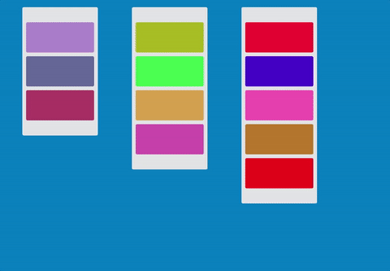

# 模仿trello的元素块拖动效果


> 类似于trello可拖动元素的类库

### 使用方法

```html
<div class="container">
  <div drag style="height:100px;width:100px;background-color:green;margin:10px;"></div>
  <div drag style="height:100px;width:100px;background-color:green;margin:10px;"></div>
  <div drag style="height:100px;width:100px;background-color:green;margin:10px;"></div>
</div>
<script type="text/javascript" src="./dist/dragable.js"></script>
<script type="text/javascript">
  var containerDrag = drag(document.querySelectorAll(".container"))
</script>
```
### [demo](https://lelesbox.github.io/trello-drag/)

*注意: 被标记为drag的元素的box-sizing都是border-box*
